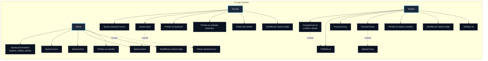

# E-Learn Use Case Diagram (Mermaid)

```mermaid
graph TB
    subgraph "E-Learn System"
        direction TB
        
        %% Actors
        Admin[Admin]
        Teacher[Teacher]
        Student[Student]
        
        %% Admin Use Cases
        Admin --> UC1[Správa používateľov<br/>študenti, učitelia, adminy]
        Admin --> UC2[Správa kurzov]
        Admin --> UC3[Správa lekcií]
        Admin --> UC4[Správa testov]
        Admin --> UC5[Pohľad na výsledky]
        Admin --> UC6[Modifikovať vlastné údaje]
        
        %% Teacher Use Cases
        Teacher --> UC7[Správa vlastných kurzov]
        Teacher --> UC8[Správa lekcií]
        Teacher --> UC9[Pohľad na študentov]
        Teacher --> UC10[Pohľad na výsledky študentov]
        Teacher --> UC11[Získať kód učiteľa]
        Teacher --> UC12[Modifikovať vlastné údaje]
        
        %% Student Use Cases
        Student --> UC13[Zaregistrovať sa<br/>s kódom učiteľa]
        Student --> UC14[Prihlásiť sa]
        Student --> UC15[Prezerať kurzy]
        Student --> UC16[Prezerať lekcie]
        Student --> UC17[Pohľad na vlastné výsledky]
        Student --> UC18[Modifikovať vlastné údaje]
        Student --> UC19[Odhlásiť sa]
        
        %% Include relationships
        UC7 -.->|include| UC20[Nahrať obrázok kurzu]
        UC8 -.->|include| UC4
        UC16 -.->|include| UC21[Napísať testy]
        UC13 -.->|include| UC14
        
        %% Styling
        classDef actor fill:#1e293b,stroke:#38bdf8,stroke-width:2px,color:#e5e7eb
        classDef usecase fill:#0b1220,stroke:#1e293b,stroke-width:1px,color:#e5e7eb
        classDef include stroke:#22c55e,stroke-width:2px,stroke-dasharray: 5 5
        
        class Admin,Teacher,Student actor
        class UC1,UC2,UC3,UC4,UC5,UC6,UC7,UC8,UC9,UC10,UC11,UC12,UC13,UC14,UC15,UC16,UC17,UC18,UC19,UC20,UC21 usecase
    end
```

## Легенда
- **Сплошные линии** - связь актера с вариантом использования
- **Пунктирные линии (include)** - включение одного варианта использования в другой
